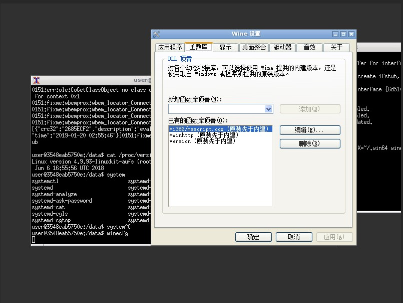

## webshellkill-cli

webshellkill-cli 是一个通过DLL Injection + Hook实现的库，实现了通过命令行操作 [D盾_Web查杀](http://www.d99net.net/)的功能，支持Web查杀版本 V2.0.9。

注意：本项目处于早期版本，不可于生产环境使用。

## 用法

将 version.dll 放置于 WebShellKill.exe 同目录下即可使用。
```txt

D:\Projects\WebShellKillHook\Debug>WebShellKill.exe -h

WebShellKill CLI
Usage: WebShellKill.exe [OPTIONS] [FILE]

Options:
  -h,--help                   Print this help message and exit
  -i,--show-hidden-file       扫描隐藏文件
  -z,--show-zend-file         显示经过Zend加密的文件
  -a,--auto-check-new-version 自动更新行为库
  -d,--hide-level1            隐藏低级别威胁
  -t,--type                   TBD
  -e,--exclude-dir            排除指定的文件夹（TBD）
  -f,--output TEXT            输出到文件

```
### wine使用

```bash
export LC_ALL=zh_CN.UTF-8
winetricks -q mdac28
```

接着，需要使用 winecfg，将``version.dll``配置为“原装先于内建”。


Docker To be done...

## 示例输出

``[{"crc32":"04AD707A","description":"Eval后门 {参数:$_GET[\"a\"]}","file":"","level":"4","size":"23","time":"2019-01-09 00:13:25"}]``

## 注意事项

1. WebShellKill 本身不是绿色软件，其在32位系统下会读写``HKEY_LOCAL_MACHINE\Software\d99net\d_webshell_kill``，本项目仅对读下了钩子，未对写进行处理。
2. 因为 WebShellKill 是一个 GUI 程序，本项目只对窗口进行了隐藏。因此，如果需要在Wine下使用，仍然需要X Window。
3. 本程序使用的API均为A系列，因此无论是输入输出均为ANSI编码，非中文环境下可能无法使用。在Wine下使用，必须配置环境变量``LC_ALL=zh_CN.UTF-8``，且输出需要进行编码转换：``iconv -f GBK -t UTF8``。

## 协议
The MIT License